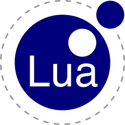
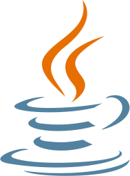

# Hello, I'm Alexander Harding.

### I'm a 🇨🇦 Canadian College Student studying Software Development!

I am studying Software Development at Mohawk College.

I love coding, My favourite thing to code are Discord Bots, they're super simple to get running and it's super cool to visually see the bot coming online.  

My favourite project I am working on is my Chat Room, Its been a great learning experience, understanding the way the client works with a database via a server and understanding basic concepts of encryption.  

I have two major projects at the moment:
1. [Basic Chat Room](https://github.com/BackwardsUser/Basic-Chat-Room) - This is a project I've been working for quite some time, I have no intention of becoming the next Discord, however it's been a pretty good learning experience.
2. [Minecraft Advanced Server Interface (MASI)](https://github.com/BackwardsUser/minecraft-advanced-server-interfacae) - This is a project that brings the online UI's of online hosting services for Minecraft Servers to a Desktop application allowing you to self host with confidence!

I do have a third project, however I am sort of waning interest in it at the moment. My Bot Manager, or Dot; I created Dot because I realized that if you were a Discord Server owner, you were forced to trust in Bot Developers, public bots, YouTube tutorials or actual coding abilities. This application was made so you could make a bot with no thought on how it worked. However I've put a hold on the bot realizing that the concept would be super difficult to bring to life as I am unsure how to implement this idea. If you have any ideas, feel free to make an issue on its repository, [Here](https://github.com/BackwardsUser/Dot-Bot-Manager/issues).  

I believe that almost every project on the internet should be open source. I believe that open source can provide so much good, and with the way its integrated with GitHub is perfect. The best way to learn and develop cool things is to let everyone give their input, you may not understand some parts of the framework you're using and the best thing that you can do is let the public either, teach you, or do it for you. ***However*** I do understand that there are some reasons that its not in the best interest of some that their work is open source, for example banks and other high security systems shouldn't be open source as it could cause a security risk to many. That is why I believe *almost* every project should be open source, also allowing devices operating systems to be open source could allow the public to burn bloatware off of some heavier operating systems like Windows 11, and the same can be done with applications and even frameworks.

## Where to find me

  

## Languages and Tools
<table width="100">
<tr>
    <td align="center" width="190">
        
    </td>
    <td align="center" width="190">
        
    </td>
    <td align="center" width="190">
        
    </td>
    <td align="center" width="190">
        
    </td> 
</tr>
<tr>
    <td align="center" width="190">
        
    </td>
    <td align="center" width="190">
        
    </td>
    <td align="center" width="190">
        
    </td>
    <td align="center" width="190">
        
    </td>
</tr>
<tr>
    <td align="center" width="190">
        
    </td>
    <td align="center" width="190">
        
    </td>
    <td align="center" width="190">
        
    </td>
    <td align="center" width="190">
        
    </td>
</tr>
</table>  

  
  
## Here's what I'm listening to:
&nbsp;

